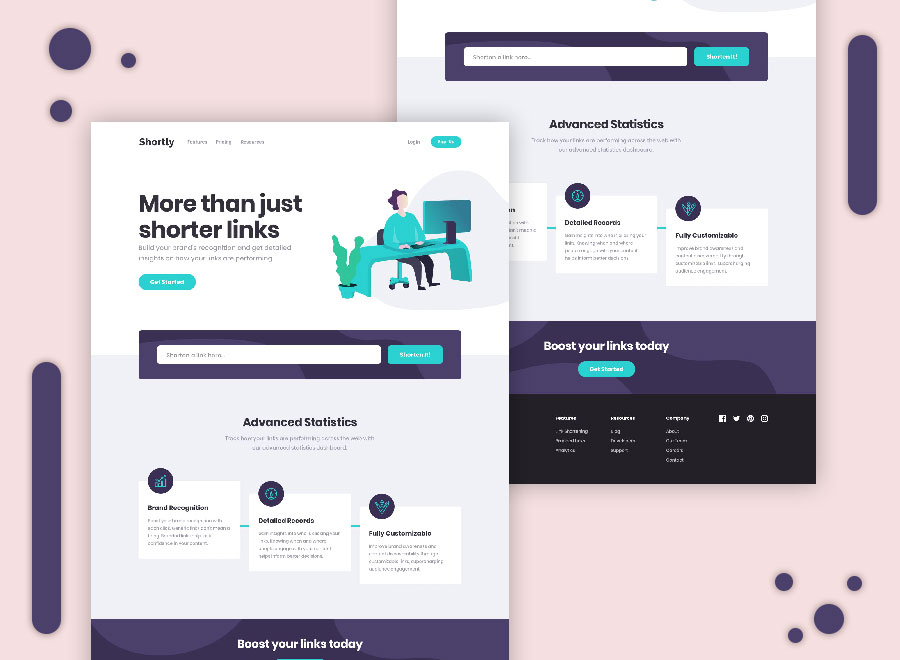

# Frontend Mentor - Shortly URL shortening API Challenge solution

Essa é uma solução do [Shortly URL shortening API Challenge challenge on Frontend Mentor](https://www.frontendmentor.io/challenges/url-shortening-api-landing-page-2ce3ob-G). Os desafios do frontend Mentor ajudam muito a desenvolver suas habilidades!

## Conteúdos

- [Sobre](#Sobre)
  - [Desafio](#Desafio)
  - [Screenshot](#screenshot)
  - [Links](#links)
  - [Tecnologias usadas](#Tecnologias-usadas)
  - [O que aprendi?](#O-que-aprendi?)
  - [O que busco no futuro?](#O-que-busco-no-futuro?)
- [Author](#Autor)

## Sobre

### Desafio

Os usuários devem conseguir acessar um site responsivo que funcione bem o mecanismo de encurtar links, fluidamente!

### Screenshot

### Links

- Frontend Mentor URL: https://www.frontendmentor.io/solutions/shortly-url-page-only-pure-js-nnkGismGU_
- URL do site: https://api-landing-page-luckthegamers.vercel.app.

### Tecnologias usadas

- CSS Flexbox.
- Usado a API https://shrtco.de.
- Javascript puro sem nenhuma biblioteca.

### O que aprendi?

 Melhorei a minha habilidade no HTML, bastante no CSS e desenvolvi ainda mais o aprendizado com o Javascript, contudo foi bastante divertido!

### O que busco no futuro?

Após trabalhar nesse projeto, buscarei alguma biblioteca como React para melhorar ainda mais meus projetos!

## Autor

- Website - https://henriqueamascarin.vercel.app.
- Frontend Mentor - https://www.frontendmentor.io/profile/LuckTheGamers.
